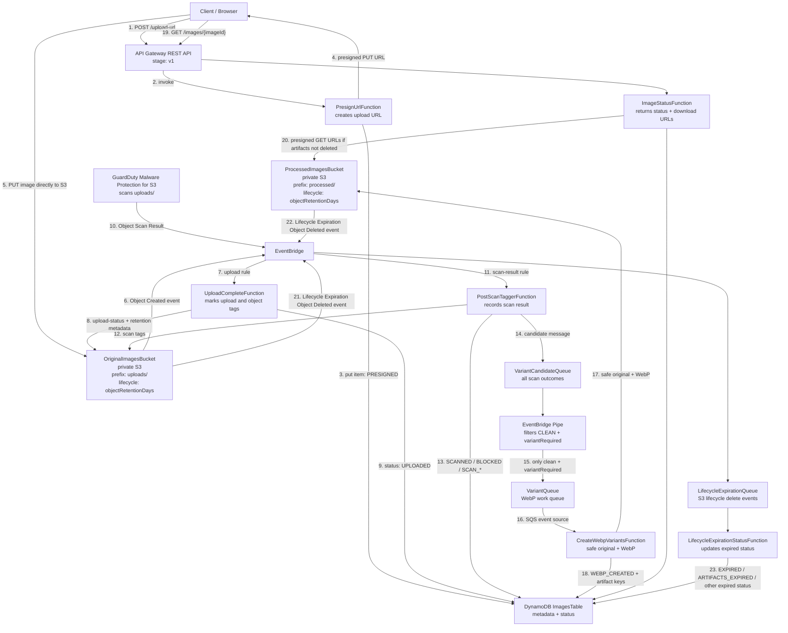

# AWS Image Resize to WebP Safety Pipeline

<p align="center">
  <strong>AWS CDK serverless pipeline for secure image upload, GuardDuty Malware Protection for S3, WebP conversion, one-day S3 object expiration, and DynamoDB status tracking.</strong>
</p>

<p align="center">
  
  
  
</p>

> [!IMPORTANT]
> This project is a teaching and reference implementation, not a production-ready security boundary by itself. Review every resource, IAM permission, retention setting, API exposure, S3 lifecycle rule, GuardDuty configuration, and cost control before deploying it in your own AWS account. You are responsible for adapting, testing, securing, monitoring, and validating the solution for your workload and compliance requirements.

---
## Architecture
### High-level visual


## Table of contents

- [What this project does](#what-this-project-does)
- [Security, ownership, and cost warning](#security-ownership-and-cost-warning)
- [Architecture](#architecture)
- [Request flow](#request-flow)
- [Lifecycle expiration behavior](#lifecycle-expiration-behavior)
- [Resource and cost controls](#resource-and-cost-controls)
- [Key resources](#key-resources)
- [Project layout](#project-layout)
- [Configuration](#configuration)
- [Deploy](#deploy)
- [Test upload](#test-upload)
- [Suggestions for Operational Checklist](#suggestions-for-operational-checklist)
- [Troubleshooting](#troubleshooting)

---

## What this project does

This repository deploys a small event-driven image-processing pipeline:

1. A browser or client asks the API for a presigned upload URL.
2. The client uploads an image directly to a private S3 bucket.
3. GuardDuty Malware Protection for S3 scans the uploaded object.
4. Clean, eligible images are forwarded through SQS and converted to WebP.
5. Processing status is tracked in DynamoDB.
6. Processed artifacts are returned through short-lived presigned download URLs.
7. Uploaded and processed objects expire through native S3 Lifecycle rules.
8. Lifecycle delete events update DynamoDB so the status record reflects expired objects.

This design intentionally separates the synchronous API path from the asynchronous scan, conversion, and expiration paths.

---

## Security, ownership, and cost warning

> [!WARNING]
> Deploying this stack creates and modifies AWS resources in your account. Some services can generate charges, including but not limited to API Gateway, Lambda, S3 storage and requests, DynamoDB, SQS, EventBridge, CloudWatch Logs, and GuardDuty Malware Protection for S3.

> [!CAUTION]
> Malware scanning reduces risk, but it does not make uploaded content automatically safe for every use case. You must decide whether the security posture is sufficient for your application. Consider file type validation, authentication, authorization, rate limiting, WAF, object size limits, content moderation, audit logging, alerting, and incident response before production use.

Before deploying, review these responsibilities:

| Area | Your responsibility |
|---|---|
| AWS account safety | Deploy only into an account and region where you are allowed to create resources. |
| IAM and permissions | Review generated IAM roles and policies. Tighten permissions for your environment. |
| API exposure | Decide whether public CORS and unauthenticated API access are acceptable. |
| GuardDuty | Confirm GuardDuty is enabled, configured, and supported in your target region. |
| Data retention | Confirm one-day S3 Lifecycle expiration matches your data retention needs. |
| Cost controls | Set budgets, billing alerts, CloudWatch alarms, API throttles, and workload limits. |
| Compliance | Validate the design against your organization’s privacy, security, and legal requirements. |
| Production readiness | Add authentication, observability, deployment controls, and disaster recovery as needed. |

> [!NOTE]
> The defaults are intentionally low-throughput and teaching-oriented. They are not a guarantee of free operation. Always check current AWS pricing and your account usage.

---


### Mermaid architecture map



---

## Request flow

| Step | Component | What happens |
|---:|---|---|
| 1 | Client | Sends `POST /upload-url` with `filename` and `contentType`. |
| 2 | API Gateway | Invokes `PresignUrlFunction`. |
| 3 | Presign Lambda | Validates `image/*`, creates an `imageId`, stores a DynamoDB item with `status=PRESIGNED`, and returns a presigned S3 PUT URL. |
| 4 | Client | Uploads the image directly to the original S3 bucket under `uploads/{imageId}/{filename}`. |
| 5 | S3 + EventBridge | S3 emits an `Object Created` event. |
| 6 | Upload-complete Lambda | Reads object metadata, tags the S3 object, and updates DynamoDB to `UPLOADED`. |
| 7 | GuardDuty | Scans the uploaded object and emits an object scan result event. |
| 8 | Post-scan Lambda | Writes scan metadata and object tags, updates DynamoDB, and sends a candidate message to SQS. |
| 9 | EventBridge Pipe | Forwards only clean, variant-required messages to the WebP queue. |
| 10 | WebP Lambda | Re-checks original object tags, copies a safe original, creates a WebP artifact, and updates DynamoDB to `WEBP_CREATED`. |
| 11 | Status API | Reads DynamoDB and returns short-lived download URLs only for artifacts that have not been marked deleted. |
| 12 | S3 Lifecycle | Expires uploaded and processed objects asynchronously after the configured retention period. |
| 13 | Lifecycle status Lambda | Updates DynamoDB when S3 emits lifecycle-expiration delete events. |

---

## Lifecycle expiration behavior

The stack uses native S3 Lifecycle expiration instead of a scheduled cleanup Lambda.

```text
S3 lifecycle expiration
  -> S3 Object Deleted EventBridge event
  -> LifecycleExpirationQueue
  -> LifecycleExpirationStatusFunction
  -> DynamoDB image record update
```

The default retention period is one day:

- `uploads/` objects expire after `objectRetentionDays`.
- `processed/` objects expire after `objectRetentionDays`.

> [!IMPORTANT]
> S3 Lifecycle expiration is asynchronous. DynamoDB is updated when S3 actually emits an `Object Deleted` event with `reason = Lifecycle Expiration`. This may happen after the configured one-day lifecycle point. Do not build user-facing promises that assume deletion occurs at an exact timestamp.

### Expiration statuses

The lifecycle status function classifies the final status based on which objects existed and which lifecycle delete events have arrived.

| Status | Meaning |
|---|---|
| `EXPIRED` | Original-only record expired. |
| `ARTIFACTS_EXPIRED` | Processed artifacts expired after WebP processing. |
| `BLOCKED_EXPIRED` | A blocked image’s original object expired. |
| `SCAN_RESULT_EXPIRED` | A scan-failed, scan-skipped, or scan-unknown object expired. |
| `PARTIALLY_EXPIRED` | Some, but not all, expected lifecycle delete events have been processed. |

---

## Resource and cost controls

This stack is designed for small demos and free-tier-oriented experimentation. It avoids function-level reserved concurrency because new or limited AWS accounts can have a regional Lambda concurrency quota of `10`, and reserved concurrency can cause deployment failures by consuming required unreserved capacity.

| Control | Default | Why it exists |
|---|---:|---|
| API Gateway rate limit | `10 req/s` | Limits incoming API pressure. |
| API Gateway burst limit | `20` | Limits short traffic spikes. |
| WebP SQS batch size | `1` | Keeps image-processing work small and predictable. |
| WebP SQS max concurrency | `2` | Limits concurrent image conversion. |
| Lifecycle SQS batch size | `5` | Processes expiration updates in small batches. |
| Lifecycle SQS max concurrency | `2` | Limits DynamoDB update concurrency. |
| Work queue retention | `1 day` | Avoids keeping stale work messages too long. |
| DLQ retention | `4 days` | Gives time to inspect failures without long retention. |
| S3 object retention | `1 day` | Removes uploaded and processed objects automatically. |
| Lambda timeouts | Bounded in config | Prevents long-running runaway functions. |

> [!WARNING]
> These controls reduce blast radius but do not eliminate cost risk. Large files, repeated uploads, high request rates, CloudWatch log volume, GuardDuty scanning volume, and failed retry loops can still create charges. Configure AWS Budgets and alarms before sharing the API or running load tests.

---

## Key resources

- API Gateway REST API
- Original S3 bucket with lifecycle expiration for `uploads/`
- Processed S3 bucket with lifecycle expiration for `processed/`
- DynamoDB image status table
- Presign URL Lambda
- Upload-complete Lambda
- GuardDuty post-scan Lambda
- WebP conversion Lambda
- Image status Lambda
- Lifecycle-expiration status Lambda
- Variant candidate SQS queue and DLQ
- Variant work SQS queue and DLQ
- Lifecycle expiration SQS queue and DLQ
- EventBridge rules for S3 upload, GuardDuty scan result, and S3 lifecycle expiration
- EventBridge Pipe for clean-image filtering
- GuardDuty Malware Protection for S3 plan

---

## Project layout

```text
bin/
  app.js

lib/
  image-pipeline-stack.js          # Stack composition / orchestration
  pipeline-config.js               # Defaults, validation, throttles, retention settings
  permissions/
    s3-tags.js                     # Helper for object-tag IAM permissions
  resources/
    api.js                         # API Gateway routes and CORS
    database.js                    # DynamoDB image status table
    events.js                      # EventBridge rules and EventBridge Pipe
    functions.js                   # Lambda functions, SQS event sources, grants
    malware-protection.js          # GuardDuty Malware Protection plan and role
    outputs.js                     # CloudFormation outputs
    queues.js                      # SQS queues and DLQs
    storage.js                     # S3 buckets, CORS, lifecycle rules

lambda/
  presign/
  upload-complete/
  post-scan/
  create-webp-variants/
  status/
  lifecycle-expiration-status/

scripts/
  check-syntax.cjs
  install-lambda-sharp.cjs
  write-commonjs-package.cjs

test-ui/
  index.html
  README.md
```

---

## Configuration

Defaults are stored in `cdk.json` and validated in `lib/pipeline-config.js`.

```json
{
  "objectRetentionDays": 1,
  "apiThrottleRateLimit": 10,
  "apiThrottleBurstLimit": 20,
  "webpBatchSize": 1,
  "webpMaxBatchingWindowSeconds": 5,
  "webpMaxConcurrency": 2,
  "lifecycleExpirationStatusBatchSize": 5,
  "lifecycleExpirationStatusMaxBatchingWindowSeconds": 10,
  "lifecycleExpirationStatusMaxConcurrency": 2,
  "workQueueRetentionDays": 1,
  "dlqRetentionDays": 4,
  "queueMaxReceiveCount": 3
}
```

### Important context values

| Context key | Default | Allowed range | Description |
|---|---:|---:|---|
| `objectRetentionDays` | `1` | `1` to `7` | S3 Lifecycle expiration for uploaded and processed objects. |
| `resizeThresholdBytes` | `0` | `0` to `104857600` | Minimum object size for WebP conversion. `0` converts every clean image. |
| `webMaxWidth` | `1280` | `64` to `4096` | Maximum WebP width; images are not enlarged. |
| `webpQuality` | `72` | `1` to `100` | WebP output quality. |
| `uploadUrlExpiresSeconds` | `900` | `60` to `3600` | Presigned PUT URL lifetime. |
| `downloadUrlExpiresSeconds` | `900` | `60` to `3600` | Presigned GET URL lifetime. |
| `apiThrottleRateLimit` | `10` | `1` to `50` | API Gateway steady-state request throttle. |
| `apiThrottleBurstLimit` | `20` | `1` to `100` | API Gateway burst throttle. |
| `webpBatchSize` | `1` | `1` to `10` | SQS batch size for WebP work. |
| `webpMaxConcurrency` | `2` | `2` to `10` | SQS event-source max concurrency for WebP. |
| `lifecycleExpirationStatusBatchSize` | `5` | `1` to `10` | SQS batch size for lifecycle status updates. |
| `lifecycleExpirationStatusMaxConcurrency` | `2` | `2` to `10` | SQS event-source max concurrency for lifecycle updates. |
| `workQueueRetentionDays` | `1` | `1` to `4` | Retention for work queues. |
| `dlqRetentionDays` | `4` | `1` to `14` | Retention for dead-letter queues. |
| `queueMaxReceiveCount` | `3` | `1` to `5` | Failed receive attempts before moving to DLQ. |

Example override:

```bash
npx cdk deploy \
  -c objectRetentionDays=2 \
  -c apiThrottleRateLimit=5 \
  -c apiThrottleBurstLimit=10 \
  -c webpMaxConcurrency=2
```

---

## Deploy

### Prerequisites

- Node.js 22 or later
- npm
- AWS CLI configured for your target account and region
- AWS CDK v2 through `npx cdk`
- GuardDuty enabled in the target region

### Install and validate

```bash
npm install
npm run check
npx cdk synth
```

### Bootstrap and deploy

```bash
npx cdk bootstrap
npx cdk deploy
```

For a specific AWS profile and region:

```bash
export AWS_PROFILE=your-profile
export AWS_REGION=us-east-2
npx cdk bootstrap aws://$(aws sts get-caller-identity --query Account --output text)/$AWS_REGION
npx cdk deploy
```

### Enable GuardDuty if needed

GuardDuty must be enabled in the deployment region before creating the malware protection plan.

```bash
aws guardduty list-detectors --region <region>
aws guardduty create-detector --enable --region <region>
```

Run `create-detector` only when `list-detectors` returns no detector ID.

> [!CAUTION]
> Enabling GuardDuty and Malware Protection for S3 can create service charges. Confirm pricing and account policy before enabling it.

---

## Test upload

After deployment, copy the `UploadUrlEndpoint` stack output.

```bash
UPLOAD_ENDPOINT="https://YOUR_API_ID.execute-api.YOUR_REGION.amazonaws.com/v1/upload-url"
FILE_PATH="./sample.jpg"
CONTENT_TYPE="image/jpeg"

RESPONSE=$(curl -s -X POST "$UPLOAD_ENDPOINT" \
  -H "Content-Type: application/json" \
  -d "{\"filename\":\"sample.jpg\",\"contentType\":\"$CONTENT_TYPE\"}")

UPLOAD_URL=$(echo "$RESPONSE" | node -pe "JSON.parse(fs.readFileSync(0, 'utf8')).uploadUrl")
IMAGE_ID=$(echo "$RESPONSE" | node -pe "JSON.parse(fs.readFileSync(0, 'utf8')).imageId")

curl -X PUT "$UPLOAD_URL" \
  -H "Content-Type: $CONTENT_TYPE" \
  --data-binary "@$FILE_PATH"

STATUS_ENDPOINT="${UPLOAD_ENDPOINT%/upload-url}/images/$IMAGE_ID"
curl -s "$STATUS_ENDPOINT"
```

Poll until a terminal processing status appears:

```bash
while true; do
  STATUS_JSON=$(curl -s "$STATUS_ENDPOINT")
  echo "$STATUS_JSON"
  STATUS=$(echo "$STATUS_JSON" | node -pe "JSON.parse(fs.readFileSync(0, 'utf8')).status")
  case "$STATUS" in
    WEBP_CREATED|BLOCKED|SCAN_FAILED|SCAN_SKIPPED|SCAN_UNKNOWN) break ;;
  esac
  sleep 10
done
```

---

## Suggestions for Operational Checklist

Before using this beyond a local demo, consider the following:

- [ ] Add authentication and authorization to API Gateway.
- [ ] Restrict CORS origins instead of using `*`.
- [ ] Add request validation and file size limits.
- [ ] Add AWS WAF or another perimeter control for public APIs.
- [ ] Configure AWS Budgets and billing alerts.
- [ ] Add CloudWatch alarms for Lambda errors, throttles, DLQ depth, and API 4xx/5xx rates.
- [ ] Review CloudWatch log retention and sensitive data logging.
- [ ] Review S3 lifecycle retention against data retention requirements.
- [ ] Review IAM policies and narrow them for your environment.
- [ ] Test malware-positive, scan-failure, large-image, and lifecycle-expiration cases.
- [ ] Decide whether DynamoDB records should also expire or be archived.
- [ ] Add CI/CD controls, environment separation, and change approval if used by a team.

---

## Operational notes

- Buckets are private and require HTTPS.
- The API returns presigned URLs instead of exposing S3 objects publicly.
- The WebP Lambda validates S3 object tags before reading uploaded objects.
- Only clean and variant-required images are converted.
- Lifecycle-expiration events are processed asynchronously through SQS.
- Default removal policy is `DESTROY`; use `-c prod=true` only after confirming your retention requirements.
- DynamoDB records are not automatically removed by S3 lifecycle; lifecycle events update status fields.

---

## Troubleshooting

### Lambda reserved concurrency failure

This project intentionally omits function-level reserved concurrency. Do not add reserved concurrency in accounts where the regional concurrency quota is `10`.

### SQS event-source max concurrency failure

Lambda SQS event-source `maxConcurrency` must be at least `2`. Use `webpMaxConcurrency=2` and `lifecycleExpirationStatusMaxConcurrency=2` for the lowest supported event-source concurrency.

### GuardDuty deployment failure

Confirm GuardDuty is enabled in the same region where you deploy the CDK stack.

```bash
aws guardduty list-detectors --region <region>
```

### Sharp install during synthesis

```bash
rm -rf cdk.out
npm install
npx cdk synth
```

### Node version

```bash
node --version
```

Use Node.js 22 or later.

### Lifecycle status is not updated exactly after one day

This is expected. S3 Lifecycle is asynchronous. Wait for the S3 `Object Deleted` event with `reason = Lifecycle Expiration`, then the lifecycle SQS queue and lifecycle status Lambda update DynamoDB.

---

## Cleanup

For non-production deployments, destroy the stack when finished:

```bash
npx cdk destroy
```

> [!WARNING]
> Destroy behavior depends on the stack configuration and any objects still present in S3. Review resources in the AWS console before and after cleanup. You are responsible for confirming that unwanted resources and costs have been removed.
