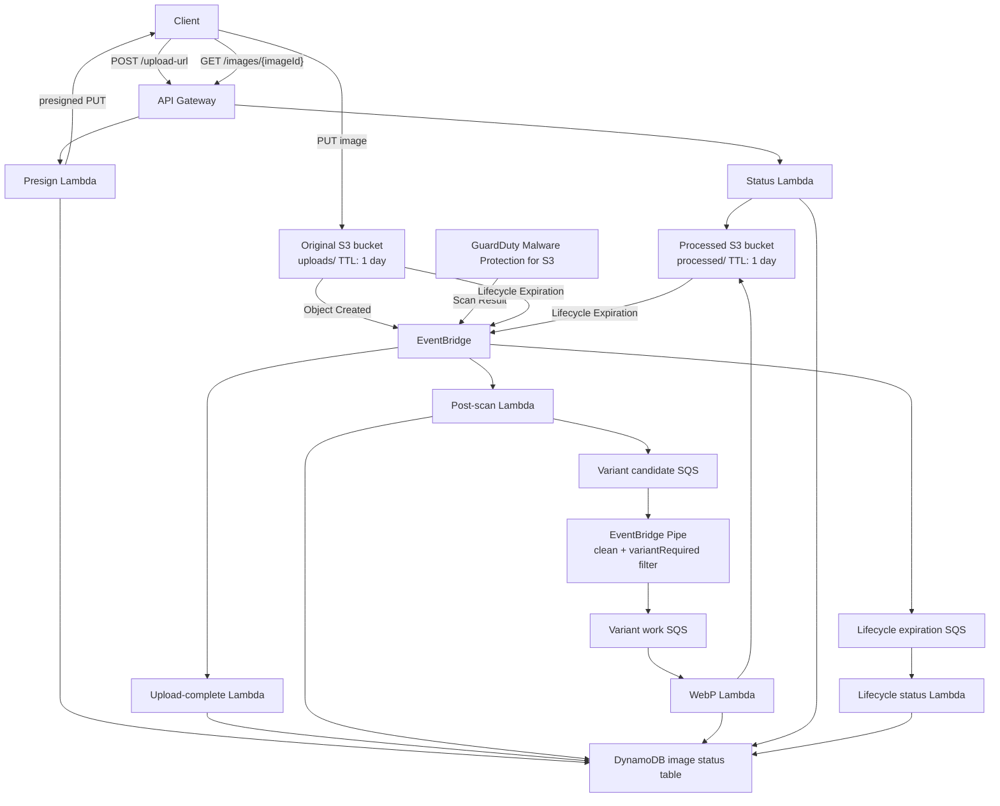

# AWS Image Resize to WebP Safety Pipeline

AWS CDK serverless pipeline for secure image upload, GuardDuty Malware Protection for S3, WebP conversion, one-day S3 object expiration, and DynamoDB status tracking.


## Architecture




## Request flow

1. The client requests a presigned upload URL from `POST /upload-url`.
2. The presign Lambda creates the DynamoDB image record and returns a presigned S3 PUT URL.
3. The client uploads the original file to the private original bucket under `uploads/`.
4. S3 object-created events update the image record as uploaded.
5. GuardDuty Malware Protection scans the uploaded object and emits a scan-result event.
6. The post-scan Lambda updates DynamoDB and sends eligible work to the variant candidate queue.
7. EventBridge Pipes forwards only clean, variant-required messages to the WebP queue.
8. The WebP Lambda creates processed artifacts and updates DynamoDB.
9. The status endpoint reads DynamoDB and returns short-lived download URLs when artifacts exist.
10. S3 lifecycle-expiration events are queued before DynamoDB is updated, allowing SQS to absorb bursts.

## Free-tier-oriented profile

This stack is configured for low throughput and minimal always-on infrastructure. It does not set Lambda reserved concurrency because accounts with a regional concurrency quota of `10` must keep that concurrency unreserved.

Cost and throttling controls:

- API Gateway stage throttling defaults to `10` requests/second with `20` burst.
- Lambda functions use bounded memory and timeout values.
- WebP processing is queue-based with `batchSize=1` and `maxConcurrency=2`.
- Lifecycle-expiration status updates are queue-based with `batchSize=5` and `maxConcurrency=2`.
- SQS DLQs are configured for the WebP, candidate, and lifecycle-expiration queues.
- Work queues default to one-day message retention.
- S3 objects expire through native lifecycle rules after one day.

## S3 lifecycle and status updates

S3 lifecycle expiration is native S3 cleanup. The configured minimum TTL is one day:

- `uploads/` objects expire after `objectRetentionDays`.
- `processed/` objects expire after `objectRetentionDays`.

Lifecycle expiration is asynchronous. DynamoDB is updated only after S3 emits an `Object Deleted` EventBridge event where `reason` is `Lifecycle Expiration`.

Lifecycle status path:

```text
S3 lifecycle expiration
  -> EventBridge Object Deleted event
  -> LifecycleExpirationQueue
  -> LifecycleExpirationStatusFunction
  -> DynamoDB image record update
```

The queue protects DynamoDB and Lambda from sudden batches of lifecycle-expiration events.

## Key resources

- API Gateway REST API
- Original S3 bucket with lifecycle expiration
- Processed S3 bucket with lifecycle expiration
- DynamoDB image status table
- Presign Lambda
- Upload-complete Lambda
- Post-scan Lambda
- WebP conversion Lambda
- Image status Lambda
- Lifecycle-expiration status Lambda
- Variant candidate SQS queue and DLQ
- Variant work SQS queue and DLQ
- Lifecycle expiration SQS queue and DLQ
- EventBridge rules for S3 upload, GuardDuty scan result, and S3 lifecycle expiration
- EventBridge Pipe for clean-image filtering
- GuardDuty Malware Protection plan

## Project layout

```text
bin/app.js
lib/image-pipeline-stack.js
lib/pipeline-config.js
lib/permissions/s3-tags.js
lib/resources/api.js
lib/resources/database.js
lib/resources/events.js
lib/resources/functions.js
lib/resources/malware-protection.js
lib/resources/outputs.js
lib/resources/queues.js
lib/resources/storage.js
lambda/
scripts/
```

## Configuration

Defaults are stored in `cdk.json` and validated in `lib/pipeline-config.js`.

```json
{
  "objectRetentionDays": 1,
  "apiThrottleRateLimit": 10,
  "apiThrottleBurstLimit": 20,
  "webpBatchSize": 1,
  "webpMaxBatchingWindowSeconds": 5,
  "webpMaxConcurrency": 2,
  "lifecycleExpirationStatusBatchSize": 5,
  "lifecycleExpirationStatusMaxBatchingWindowSeconds": 10,
  "lifecycleExpirationStatusMaxConcurrency": 2,
  "workQueueRetentionDays": 1,
  "dlqRetentionDays": 4,
  "queueMaxReceiveCount": 3
}
```

Important constraints:

- `objectRetentionDays`: `1` to `7` days.
- `webpMaxConcurrency`: `2` to `10`. CDK and Lambda require SQS event-source max concurrency to be at least `2`.
- `lifecycleExpirationStatusMaxConcurrency`: `2` to `10`.
- `uploadUrlExpiresSeconds` and `downloadUrlExpiresSeconds`: `60` to `3600` seconds.
- `resizeThresholdBytes`: `0` to `104857600` bytes.
- `webMaxWidth`: `64` to `4096` pixels.
- `webpQuality`: `1` to `100`.

## Deploy

```bash
npm install
npm run check
npx cdk bootstrap
npx cdk synth
npx cdk deploy
```

GuardDuty must be enabled in the deployment region before creating the malware protection plan.

```bash
aws guardduty list-detectors --region <region>
aws guardduty create-detector --enable --region <region>
```

Run `create-detector` only when `list-detectors` returns no detector ID.

## Test upload

After deployment, use the `UploadUrlEndpoint` stack output.

```bash
UPLOAD_ENDPOINT="https://YOUR_API_ID.execute-api.YOUR_REGION.amazonaws.com/v1/upload-url"
FILE_PATH="./sample.jpg"
CONTENT_TYPE="image/jpeg"

RESPONSE=$(curl -s -X POST "$UPLOAD_ENDPOINT" \
  -H "Content-Type: application/json" \
  -d "{\"filename\":\"sample.jpg\",\"contentType\":\"$CONTENT_TYPE\"}")

UPLOAD_URL=$(echo "$RESPONSE" | node -pe "JSON.parse(fs.readFileSync(0, 'utf8')).uploadUrl")
IMAGE_ID=$(echo "$RESPONSE" | node -pe "JSON.parse(fs.readFileSync(0, 'utf8')).imageId")

curl -X PUT "$UPLOAD_URL" \
  -H "Content-Type: $CONTENT_TYPE" \
  --data-binary "@$FILE_PATH"

STATUS_ENDPOINT="${UPLOAD_ENDPOINT%/upload-url}/images/$IMAGE_ID"
curl -s "$STATUS_ENDPOINT"
```

## Operational notes

- Buckets are private and require HTTPS.
- The API returns presigned URLs instead of exposing S3 objects publicly.
- The WebP Lambda validates S3 object tags before reading uploaded objects.
- Only clean and variant-required images are converted.
- Lifecycle-expiration events are processed asynchronously through SQS.
- Default removal policy is `DESTROY`; use `-c prod=true` to retain stateful resources.

## Troubleshooting

### Lambda reserved concurrency failure

This project intentionally omits function-level reserved concurrency. Do not add reserved concurrency in accounts where the regional concurrency quota is `10`.

### SQS event-source max concurrency failure

Lambda SQS event-source `maxConcurrency` must be at least `2`. Use `webpMaxConcurrency=2` and `lifecycleExpirationStatusMaxConcurrency=2` for the lowest supported event-source concurrency.

### Sharp install during synthesis

```bash
rm -rf cdk.out
npm install
npx cdk synth
```

### Node version

```bash
node --version
```

Use Node.js 22 or later.
