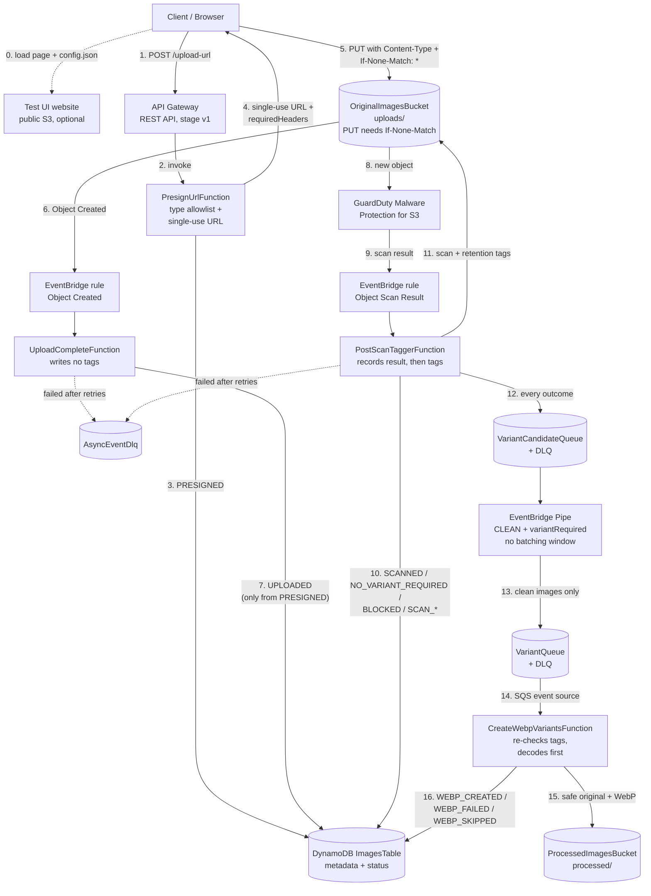
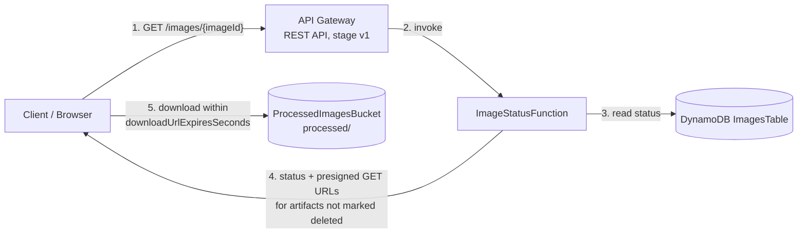
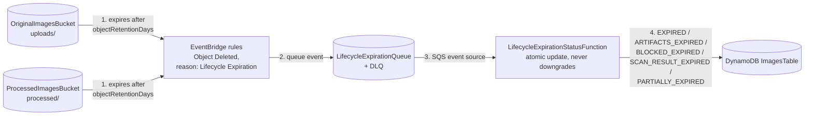

# AWS Image Resize to WebP Safety Pipeline

<p align="center">
  <strong>AWS CDK serverless pipeline for secure image upload, GuardDuty Malware Protection for S3, WebP conversion, one-day S3 object expiration, and DynamoDB status tracking.</strong>
</p>

<p align="center">
  
  
  
</p>

<p align="center">
  
</p>

> [!IMPORTANT]
> This project is a teaching and reference implementation, not a production-ready security boundary by itself. Review every resource, IAM permission, retention setting, API exposure, S3 lifecycle rule, GuardDuty configuration, and cost control before deploying it in your own AWS account. You are responsible for adapting, testing, securing, monitoring, and validating the solution for your workload and compliance requirements.

---

## Table of contents

- [What this project does](#what-this-project-does)
- [Security, ownership, and cost warning](#security-ownership-and-cost-warning)
- [Architecture](#architecture)
- [Request flow](#request-flow)
- [Processing statuses](#processing-statuses)
- [Lifecycle expiration behavior](#lifecycle-expiration-behavior)
- [Resource and cost controls](#resource-and-cost-controls)
- [Key resources](#key-resources)
- [Project layout](#project-layout)
- [Configuration](#configuration)
- [Deploy](#deploy)
- [Test upload](#test-upload)
- [Suggestions for Operational Checklist](#suggestions-for-operational-checklist)
- [Operational notes](#operational-notes)
- [Troubleshooting](#troubleshooting)
- [Cleanup](#cleanup)
- [Design decisions: v1 to v2](#design-decisions-v1-to-v2)
- [Well-Architected self-assessment](#well-architected-self-assessment)

---

## What this project does

This repository deploys a small event-driven image-processing pipeline:

1. A browser or client asks the API for a presigned upload URL.
2. The client uploads an image directly to a private S3 bucket.
3. GuardDuty Malware Protection for S3 scans the uploaded object.
4. Clean, eligible images are forwarded through SQS and converted to WebP.
5. Processing status is tracked in DynamoDB.
6. Processed artifacts are returned through short-lived presigned download URLs.
7. Uploaded and processed objects expire through native S3 Lifecycle rules.
8. Lifecycle delete events update DynamoDB so the status record reflects expired objects.

This design intentionally separates the synchronous API path from the asynchronous scan, conversion, and expiration paths.

> [!NOTE]
> This is v2 of the project. It keeps v1's architecture but hardens it against retries, duplicate events, malformed uploads, and attempts to bypass the malware scan, and it adds a hosted test UI. See [Design decisions: v1 to v2](#design-decisions-v1-to-v2) for what changed and why, including the **breaking changes for v1 clients**, and the [Well-Architected self-assessment](#well-architected-self-assessment) for how both versions compare.

---

## Security, ownership, and cost warning

> [!WARNING]
> Deploying this stack creates and modifies AWS resources in your account. Some services can generate charges, including but not limited to API Gateway, Lambda, S3 storage and requests, DynamoDB, SQS, EventBridge, CloudWatch Logs, and GuardDuty Malware Protection for S3.

> [!CAUTION]
> Malware scanning reduces risk, but it does not make uploaded content automatically safe for every use case. You must decide whether the security posture is sufficient for your application. Consider file type validation, authentication, authorization, rate limiting, WAF, object size limits, content moderation, audit logging, alerting, and incident response before production use.

Before deploying, review these responsibilities:

| Area | Your responsibility |
|---|---|
| AWS account safety | Deploy only into an account and region where you are allowed to create resources. |
| IAM and permissions | Review generated IAM roles and policies. Tighten permissions for your environment. |
| API exposure | Decide whether public CORS and unauthenticated API access are acceptable. The test UI website (`TestUiUrl`) is public, so anyone with its URL can upload through your API; deploy with `-c deployTestUi=false` if that is not acceptable. |
| GuardDuty | Confirm Malware Protection for S3 is supported in your target region and its pricing fits your usage. |
| Data retention | Confirm one-day S3 Lifecycle expiration matches your data retention needs. |
| Cost controls | Set budgets, billing alerts, CloudWatch alarms, API throttles, and workload limits. |
| Compliance | Validate the design against your organization’s privacy, security, and legal requirements. |
| Production readiness | Add authentication, observability, deployment controls, and disaster recovery as needed. |

> [!NOTE]
> The defaults are intentionally low-throughput and teaching-oriented. They are not a guarantee of free operation. Always check current AWS pricing and your account usage.

---

## Architecture

The diagram at the top of this page gives the overview; the numbered steps in its "How it works" panel follow the request from upload to expiration. It is generated from [`docs/diagram/build.mjs`](docs/diagram/build.mjs) with `npm run diagram`, using the official AWS Architecture Icons.

### Mermaid architecture map

This map shows the same flow in more detail and is kept in sync with the code, as three flowcharts. Solid arrows are the main flow; dashed arrows are optional or failure paths. Every DynamoDB status write is conditional and only moves forward (see [Processing statuses](#processing-statuses)).

#### Upload, malware scan, and WebP conversion



#### Status API



#### Lifecycle expiration



---

## Request flow

| Step | Component | What happens |
|---:|---|---|
| 1 | Client | Sends `POST /upload-url` with `filename` and `contentType`. |
| 2 | API Gateway | Invokes `PresignUrlFunction`. |
| 3 | Presign Lambda | Checks `contentType` against an allowlist (JPEG, PNG, WebP, GIF, AVIF, TIFF), creates an `imageId`, stores a DynamoDB item with `status=PRESIGNED`, and returns a presigned S3 PUT URL. |
| 4 | Client | Uploads the image directly to the original S3 bucket under `uploads/{imageId}/{filename}`, sending the `requiredHeaders` from the presign response (`Content-Type` and `If-None-Match: *`). Both headers are signed into the URL, and S3 refuses to replace an existing key, so each URL creates the object exactly once. |
| 5 | S3 + EventBridge | S3 emits an `Object Created` event. |
| 6 | Upload-complete Lambda | Reads object metadata, records it in DynamoDB, and moves the status to `UPLOADED` if it is still `PRESIGNED`. It writes no object tags, because it runs at the same time as the post-scan Lambda. |
| 7 | GuardDuty | Scans the uploaded object and emits an object scan result event. |
| 8 | Post-scan Lambda | Records the scan result in DynamoDB (duplicate or late results are ignored), writes scan and retention tags, and sends a candidate message to SQS. Clean images that will not be converted get `NO_VARIANT_REQUIRED`. |
| 9 | EventBridge Pipe | Forwards only clean, variant-required messages to the WebP queue. |
| 10 | WebP Lambda | Re-checks original object tags, decodes the image (only JPEG, PNG, WebP, GIF, TIFF, or AVIF content is accepted), writes the safe original and WebP artifact, and updates DynamoDB to `WEBP_CREATED`. Undecodable input or exhausted retries set `WEBP_FAILED`; missing clean tags set `WEBP_SKIPPED`. |
| 11 | Status API | Reads DynamoDB and returns short-lived download URLs only for artifacts that have not been marked deleted. |
| 12 | S3 Lifecycle | Expires uploaded and processed objects asynchronously after the configured retention period. |
| 13 | Lifecycle status Lambda | Updates DynamoDB when S3 emits lifecycle-expiration delete events. |

---

## Processing statuses

Statuses only move forward. Each Lambda changes `status` with a DynamoDB condition, so retries, duplicate events (S3 and GuardDuty deliver at least once), and out-of-order Lambdas cannot roll a record back.

| Status | Final? | Meaning |
|---|---|---|
| `PRESIGNED` | No | Upload URL issued; nothing uploaded yet. |
| `UPLOADED` | No | Object written to S3; waiting for the malware scan. |
| `SCANNED` | No | Clean; queued for WebP conversion. |
| `WEBP_CREATED` | Yes | Safe original and WebP artifact are available through the status API. |
| `WEBP_FAILED` | Yes | The upload could not be decoded as a supported image, or conversion retries were exhausted. See `variantFailureReason`. |
| `WEBP_SKIPPED` | Yes | The original object's tags no longer marked it clean when conversion ran, for example because it was overwritten. |
| `NO_VARIANT_REQUIRED` | Yes | Clean, but not converted. See `variantSkipReason` (`BELOW_SIZE_THRESHOLD` or `UNSUPPORTED_CONTENT_TYPE`). |
| `BLOCKED` | Yes | GuardDuty found a threat. |
| `SCAN_FAILED`, `SCAN_SKIPPED`, `SCAN_UNKNOWN` | Yes | GuardDuty could not produce a clean or malicious verdict. |

Records later move to the [expiration statuses](#expiration-statuses) below when S3 Lifecycle deletes their objects.

---

## Lifecycle expiration behavior

The stack uses native S3 Lifecycle expiration instead of a scheduled cleanup Lambda.

```text
S3 lifecycle expiration
  -> S3 Object Deleted EventBridge event
  -> LifecycleExpirationQueue
  -> LifecycleExpirationStatusFunction
  -> DynamoDB image record update
```

The default retention period is one day:

- `uploads/` objects expire after `objectRetentionDays`.
- `processed/` objects expire after `objectRetentionDays`.

> [!IMPORTANT]
> S3 Lifecycle expiration is asynchronous. DynamoDB is updated when S3 actually emits an `Object Deleted` event with `reason = Lifecycle Expiration`. This may happen after the configured one-day lifecycle point. Do not build user-facing promises that assume deletion occurs at an exact timestamp.

### Expiration statuses

The lifecycle status function classifies the final status based on which objects existed and which lifecycle delete events have arrived.

| Status | Meaning |
|---|---|
| `EXPIRED` | Original-only record expired. |
| `ARTIFACTS_EXPIRED` | Processed artifacts expired after WebP processing. |
| `BLOCKED_EXPIRED` | A blocked image’s original object expired. |
| `SCAN_RESULT_EXPIRED` | A scan-failed, scan-skipped, or scan-unknown object expired. |
| `PARTIALLY_EXPIRED` | Some, but not all, expected lifecycle delete events have been processed. |

---

## Resource and cost controls

This stack is designed for small demos and free-tier-oriented experimentation. It avoids function-level reserved concurrency because new or limited AWS accounts can have a regional Lambda concurrency quota of `10`, and reserved concurrency can cause deployment failures by consuming required unreserved capacity.

| Control | Default | Why it exists |
|---|---:|---|
| API Gateway rate limit | `10 req/s` | Limits incoming API pressure. |
| API Gateway burst limit | `20` | Limits short traffic spikes. |
| WebP SQS batch size | `1` | Keeps image-processing work small and predictable. |
| WebP SQS max concurrency | `2` | Limits concurrent image conversion. |
| Lifecycle SQS batch size | `5` | Processes expiration updates in small batches. |
| Lifecycle SQS max concurrency | `2` | Limits DynamoDB update concurrency. |
| Work queue retention | `1 day` | Avoids keeping stale work messages too long. |
| DLQ retention | `4 days` | Gives time to inspect failures without long retention. |
| S3 object retention | `1 day` | Removes uploaded and processed objects automatically. |
| Lambda timeouts | Bounded in config | Prevents long-running runaway functions. |

> [!WARNING]
> These controls reduce blast radius but do not eliminate cost risk. Large files, repeated uploads, high request rates, CloudWatch log volume, GuardDuty scanning volume, and failed retry loops can still create charges. Configure AWS Budgets and alarms before sharing the API or running load tests.

---

## Key resources

- API Gateway REST API
- Original S3 bucket with lifecycle expiration for `uploads/`
- Processed S3 bucket with lifecycle expiration for `processed/`
- DynamoDB image status table
- Presign URL Lambda
- Upload-complete Lambda
- GuardDuty post-scan Lambda
- WebP conversion Lambda
- Image status Lambda
- Lifecycle-expiration status Lambda
- Variant candidate SQS queue and DLQ
- Variant work SQS queue and DLQ
- Lifecycle expiration SQS queue and DLQ
- Async event DLQ for upload-complete and post-scan events that fail delivery or exhaust their retries
- Public S3 static website hosting the test UI, created and destroyed with the stack (`TestUiUrl` output)
- EventBridge rules for S3 upload, GuardDuty scan result, and S3 lifecycle expiration
- EventBridge Pipe for clean-image filtering
- GuardDuty Malware Protection for S3 plan

---

## Project layout

```text
bin/
  app.js

lib/
  image-pipeline-stack.js          # Stack composition / orchestration
  pipeline-config.js               # Defaults, validation, throttles, retention settings
  permissions/
    s3-tags.js                     # Helper for object-tag IAM permissions
  resources/
    api.js                         # API Gateway routes and CORS
    database.js                    # DynamoDB image status table
    events.js                      # EventBridge rules and EventBridge Pipe
    functions.js                   # Lambda functions, SQS event sources, grants
    malware-protection.js          # GuardDuty Malware Protection plan and role
    outputs.js                     # CloudFormation outputs
    queues.js                      # SQS queues and DLQs
    storage.js                     # S3 buckets, CORS, lifecycle rules
    test-ui.js                     # S3 static website for the test UI

lambda/
  presign/
  upload-complete/
  post-scan/
  create-webp-variants/
  status/
  lifecycle-expiration-status/

scripts/
  check-syntax.cjs
  install-lambda-sharp.cjs
  write-commonjs-package.cjs

test/
  pipeline.test.mjs                # Pipeline scenarios (npm test)
  ui.test.mjs                      # Browser tests for the test UI (npm run test:ui)
  sim.mjs                          # Wires the real handlers to in-memory AWS fakes
  fakes/                           # In-memory S3, DynamoDB, and SQS

test-ui/
  index.html
  README.md

docs/
  architecture.png                 # Overview diagram at the top of this README
  architecture.mmd                 # Mermaid source of the simple flow
  diagram/build.mjs                # Generates architecture.png (npm run diagram)

.github/workflows/ci.yml           # Checks, synth, and tests on every pull request
```

---

## Configuration

Defaults are stored in `cdk.json` and validated in `lib/pipeline-config.js`.

```json
{
  "objectRetentionDays": 1,
  "apiThrottleRateLimit": 10,
  "apiThrottleBurstLimit": 20,
  "webpBatchSize": 1,
  "webpMaxBatchingWindowSeconds": 5,
  "webpMaxConcurrency": 2,
  "lifecycleExpirationStatusBatchSize": 5,
  "lifecycleExpirationStatusMaxBatchingWindowSeconds": 10,
  "lifecycleExpirationStatusMaxConcurrency": 2,
  "workQueueRetentionDays": 1,
  "dlqRetentionDays": 4,
  "queueMaxReceiveCount": 3
}
```

### Important context values

| Context key | Default | Allowed range | Description |
|---|---:|---:|---|
| `objectRetentionDays` | `1` | `1` to `7` | S3 Lifecycle expiration for uploaded and processed objects. |
| `resizeThresholdBytes` | `0` | `0` to `104857600` | Minimum object size for WebP conversion. `0` converts every clean image. |
| `webMaxWidth` | `1280` | `64` to `4096` | Maximum WebP width; images are not enlarged. |
| `webpQuality` | `72` | `1` to `100` | WebP output quality. |
| `uploadUrlExpiresSeconds` | `900` | `60` to `3600` | Presigned PUT URL lifetime. |
| `downloadUrlExpiresSeconds` | `900` | `60` to `3600` | Presigned GET URL lifetime. |
| `apiThrottleRateLimit` | `10` | `1` to `50` | API Gateway steady-state request throttle. |
| `apiThrottleBurstLimit` | `20` | `1` to `100` | API Gateway burst throttle. |
| `webpBatchSize` | `1` | `1` to `10` | SQS batch size for WebP work. |
| `webpMaxConcurrency` | `2` | `2` to `10` | SQS event-source max concurrency for WebP. |
| `lifecycleExpirationStatusBatchSize` | `5` | `1` to `10` | SQS batch size for lifecycle status updates. |
| `lifecycleExpirationStatusMaxConcurrency` | `2` | `2` to `10` | SQS event-source max concurrency for lifecycle updates. |
| `workQueueRetentionDays` | `1` | `1` to `4` | Retention for work queues. |
| `dlqRetentionDays` | `4` | `1` to `14` | Retention for dead-letter queues. |
| `queueMaxReceiveCount` | `3` | `1` to `5` | Failed receive attempts before moving to DLQ. |
| `deployTestUi` | `true` | `true` or `false` | Hosts `test-ui/` as a public S3 static website with the stack. |

Example override:

```bash
npx cdk deploy \
  -c objectRetentionDays=2 \
  -c apiThrottleRateLimit=5 \
  -c apiThrottleBurstLimit=10 \
  -c webpMaxConcurrency=2
```

---

## Deploy

### Prerequisites

- Node.js 22 or later
- npm
- AWS CLI configured for your target account and region
- AWS CDK v2 through `npx cdk`
- A region where GuardDuty Malware Protection for S3 is available (a GuardDuty detector is not required)

### Install and validate

```bash
npm install
npm run check          # syntax check
npm run format:check   # Prettier formatting
npx cdk synth          # bundles every Lambda and writes the CloudFormation template
npm test               # pipeline test suite (needs the synthesized template and Node.js 22.15+)
```

`npm test` runs the real Lambda handlers against in-memory fakes of S3, DynamoDB, and SQS, including retries, duplicate events, race conditions, and the single-use upload URL rules. `npm run test:ui` drives the test UI in a headless browser (Edge on Windows; elsewhere run `npx playwright install chromium` first). Continuous integration runs the same checks on every pull request.

### Bootstrap and deploy

```bash
npx cdk bootstrap
npx cdk deploy
```

For a specific AWS profile and region:

```bash
export AWS_PROFILE=your-profile
export AWS_REGION=us-east-2
npx cdk bootstrap aws://$(aws sts get-caller-identity --query Account --output text)/$AWS_REGION
npx cdk deploy
```

### GuardDuty

The stack creates a Malware Protection for S3 plan. AWS supports this feature on its own, so you do not need to enable GuardDuty (create a detector) first. Without a detector, scan results still reach EventBridge and object tags, but GuardDuty does not generate findings. If your account already uses GuardDuty, the plan works alongside it.

Creating a detector (`aws guardduty create-detector`) turns on GuardDuty's broader threat detection, which is billed separately. Only do it if you want that.

> [!CAUTION]
> Malware Protection for S3 is billed per object and per GB scanned. Confirm pricing and account policy before deploying.

---

## Test upload

The quickest way is the test UI: open the `TestUiUrl` stack output in a browser. The page is already connected to the stack's API through a `config.json` deployed next to it. S3 website endpoints serve HTTP only, so the URL starts with `http://`.

To test from the command line, copy the `UploadUrlEndpoint` stack output. `contentType` must be one of `image/jpeg`, `image/png`, `image/webp`, `image/gif`, `image/avif`, or `image/tiff`.

```bash
UPLOAD_ENDPOINT="https://YOUR_API_ID.execute-api.YOUR_REGION.amazonaws.com/v1/upload-url"
FILE_PATH="./sample.jpg"
CONTENT_TYPE="image/jpeg"

RESPONSE=$(curl -s -X POST "$UPLOAD_ENDPOINT" \
  -H "Content-Type: application/json" \
  -d "{\"filename\":\"sample.jpg\",\"contentType\":\"$CONTENT_TYPE\"}")

UPLOAD_URL=$(echo "$RESPONSE" | node -pe "JSON.parse(fs.readFileSync(0, 'utf8')).uploadUrl")
IMAGE_ID=$(echo "$RESPONSE" | node -pe "JSON.parse(fs.readFileSync(0, 'utf8')).imageId")

# Both headers are signed into the URL; S3 rejects the PUT with 403 without
# them, and with 412 if the URL was already used.
curl -X PUT "$UPLOAD_URL" \
  -H "Content-Type: $CONTENT_TYPE" \
  -H "If-None-Match: *" \
  --data-binary "@$FILE_PATH"

STATUS_ENDPOINT="${UPLOAD_ENDPOINT%/upload-url}/images/$IMAGE_ID"
curl -s "$STATUS_ENDPOINT"
```

Poll until a final [processing status](#processing-statuses) appears:

```bash
while true; do
  STATUS_JSON=$(curl -s "$STATUS_ENDPOINT")
  echo "$STATUS_JSON"
  STATUS=$(echo "$STATUS_JSON" | node -pe "JSON.parse(fs.readFileSync(0, 'utf8')).status")
  case "$STATUS" in
    WEBP_CREATED|WEBP_FAILED|WEBP_SKIPPED|NO_VARIANT_REQUIRED|BLOCKED|SCAN_FAILED|SCAN_SKIPPED|SCAN_UNKNOWN) break ;;
  esac
  sleep 10
done
```

---

## Suggestions for Operational Checklist

Before using this beyond a local demo, consider the following:

- [ ] Add authentication and authorization to API Gateway.
- [ ] Restrict CORS origins instead of using `*`.
- [ ] Add request validation and file size limits.
- [ ] Add AWS WAF or another perimeter control for public APIs.
- [ ] Configure AWS Budgets and billing alerts.
- [ ] Add CloudWatch alarms for Lambda errors, throttles, DLQ depth, and API 4xx/5xx rates.
- [ ] Review CloudWatch log retention and sensitive data logging.
- [ ] Review S3 lifecycle retention against data retention requirements.
- [ ] Review IAM policies and narrow them for your environment.
- [ ] Test malware-positive, scan-failure, large-image, and lifecycle-expiration cases.
- [ ] Decide whether DynamoDB records should also expire or be archived.
- [ ] Add CI/CD controls, environment separation, and change approval if used by a team.

---

## Operational notes

- Buckets are private and require HTTPS.
- The API returns presigned URLs instead of exposing S3 objects publicly.
- The WebP Lambda validates S3 object tags before reading uploaded objects.
- Only clean and variant-required images are converted. The safe original is stored with the content type of its decoded format, never the type the uploader claimed.
- Upload URLs are single-use: they sign `Content-Type` and `If-None-Match: *`, and a bucket policy denies any `PutObject` to `uploads/` without `If-None-Match`. An object that has been scanned can never be replaced by an unscanned one. Post-scan and the WebP Lambda still re-check what was actually uploaded.
- The presign Lambda bundles its own AWS SDK instead of using the runtime's, and sets `requestChecksumCalculation: 'WHEN_REQUIRED'`. Recent SDKs otherwise sign a CRC32 of the empty presign body into the URL, and S3 rejects every real upload with `BadDigest`.
- Lifecycle-expiration events are processed asynchronously through SQS.
- Default removal policy is `DESTROY`, and non-prod buckets are emptied automatically on `cdk destroy`; use `-c prod=true` (or `"prod": true` in `cdk.json`) only after confirming your retention requirements.
- DynamoDB records are not automatically removed by S3 lifecycle; lifecycle events update status fields.

---

## Troubleshooting

### Lambda reserved concurrency failure

This project intentionally omits function-level reserved concurrency. Do not add reserved concurrency in accounts where the regional concurrency quota is `10`.

### SQS event-source max concurrency failure

Lambda SQS event-source `maxConcurrency` must be at least `2`. Use `webpMaxConcurrency=2` and `lifecycleExpirationStatusMaxConcurrency=2` for the lowest supported event-source concurrency.

### GuardDuty deployment failure

Confirm Malware Protection for S3 is available in the region where you deploy the CDK stack. A GuardDuty detector is not required.

```bash
aws guardduty list-malware-protection-plans --region <region>
```

### Image ends in `WEBP_FAILED`, `WEBP_SKIPPED`, or `NO_VARIANT_REQUIRED`

Read `variantFailureReason` or `variantSkipReason` from the status API response. If upload-complete or post-scan fail every retry, the triggering event is kept in the async event DLQ, and the image stays at `PRESIGNED` or `UPLOADED`.

### Sharp install during synthesis

```bash
rm -rf cdk.out
npm install
npx cdk synth
```

### Node version

```bash
node --version
```

Use Node.js 22 or later.

### Lifecycle status is not updated exactly after one day

This is expected. S3 Lifecycle is asynchronous. Wait for the S3 `Object Deleted` event with `reason = Lifecycle Expiration`, then the lifecycle SQS queue and lifecycle status Lambda update DynamoDB.

---

## Cleanup

For non-production deployments, destroy the stack when finished. Non-prod buckets are emptied automatically, including the validation object GuardDuty writes at the bucket root, which lifecycle rules never expire. The test UI website is always emptied and deleted with the stack, even with `-c prod=true`:

```bash
npx cdk destroy
```

> [!WARNING]
> Destroy behavior depends on the stack configuration and any objects still present in S3. Review resources in the AWS console before and after cleanup. You are responsible for confirming that unwanted resources and costs have been removed.

`cdk destroy` does not remove two things: the Lambda log groups (`/aws/lambda/ImagePipelineStack-*`, created by Lambda rather than CloudFormation), and the IAM role CDK creates for API Gateway logging, which it retains on purpose. Delete them by hand if you don't need them.

---

## Design decisions: v1 to v2

v1 is the project's initial release. v2 is the current code. Both use the same architecture: presign → S3 upload → GuardDuty scan → EventBridge Pipe → WebP conversion → S3 Lifecycle expiration. v2 changes how each step behaves when things go wrong: retried and duplicate events, malformed uploads, and attempts to bypass the scan.

v1's choices were not careless. Most are standard patterns that are correct on the happy path, where every event arrives once, in order, and every upload is a well-formed image. The sections below explain each change, why v1 worked the way it did, and what v2 gains and gives up.

> [!IMPORTANT]
> **Upgrading from v1: breaking changes**
>
> - Clients must send every header in the presign response's `requiredHeaders` (now `Content-Type` and `If-None-Match: *`) with the S3 `PUT`. Uploads without them fail with 403, and each upload URL works once; a second `PUT` gets 412.
> - Presign accepts only `image/jpeg`, `image/png`, `image/webp`, `image/gif`, `image/avif`, and `image/tiff`. Anything else, including SVG and HEIC, gets 400.
> - Clients that poll the status API must treat `WEBP_FAILED`, `WEBP_SKIPPED`, and `NO_VARIANT_REQUIRED` as final. See [Processing statuses](#processing-statuses).
> - The stack now deploys a public test UI website by default. Use `-c deployTestUi=false` to leave it out.

| # | Decision | v1 | v2 |
|---|---|---|---|
| 1 | [Upload URL](#1-single-use-upload-urls) | Reusable for 15 minutes; only the address is signed | Single-use; `Content-Type` and `If-None-Match` signed; enforced by a bucket policy |
| 2 | [Trusting the file](#2-checking-what-the-file-actually-is) | Trusts the type the uploader claims | Checks what the file actually is |
| 3 | [Object tags](#3-one-tag-writer-at-a-time) | Two Lambdas rewrite the same tag set at the same time | One writer at each stage |
| 4 | [Status updates](#4-status-updates-that-only-move-forward) | Every write overwrites the status | Conditional writes that only move forward |
| 5 | [Failure handling](#5-every-image-reaches-a-final-status) | Failed images stay "in progress"; errors live only in DLQs | Every image reaches a final status with a reason |
| 6 | [Latency](#6-no-batching-wait-in-the-pipe) | The Pipe waits up to 30 seconds to fill a batch | The Pipe forwards messages immediately |
| 7 | [Stack lifecycle and test UI](#7-clean-destroy-and-a-hosted-test-ui) | `cdk destroy` fails; the UI runs locally only | Clean destroy; the UI is hosted with the stack |

### 1. Single-use upload URLs

A presigned URL is a time-limited link, signed with the presign Lambda's AWS credentials, that lets a client upload one object directly to S3 without having AWS credentials of its own. The signature covers the URL and any headers the signer chooses to include. The client must send those headers exactly, or S3 rejects the request.

**What changed.** In v1, the signature covered only the bucket address. A client could upload with any `Content-Type`, and could reuse the URL for as long as it was valid (15 minutes by default). In v2:

- The URL also signs `Content-Type` and `If-None-Match: *`. The `If-None-Match: *` header makes the upload an S3 *conditional write*: S3 accepts it only if no object exists at that key yet, and answers 412 otherwise.
- A bucket policy denies any upload to `uploads/` that lacks `If-None-Match`, so S3 enforces the rule even if a client or a future code change omits it.
- The presign Lambda bundles its own pinned AWS SDK and sets `requestChecksumCalculation: 'WHEN_REQUIRED'`.

**Why v1 worked this way.** This is the standard presigned-URL pattern shown in most tutorials: the client sends a `PUT` with a `Content-Type` and nothing else. S3 conditional writes only arrived in 2024, so older examples don't use them. Using the AWS SDK that ships with the Lambda runtime keeps each function bundle to a few kilobytes and cold starts fast. With the runtime's SDK at the time, the URLs worked.

**Why v2 is better.**

- **It closes a scan bypass.** In v1, a client could upload a harmless file, let it pass the malware scan, then reuse the same URL to replace it with an unscanned file before conversion. This is a *time-of-check to time-of-use* (TOCTOU) gap: the file that was checked is not the file that gets used. Because each URL can now create its object only once, a scanned object can never be replaced.
- **It enforces the declared file type at the source.** A client can no longer request a URL for `image/png` and then upload `text/html`.
- **It removes a hidden dependency on the Lambda runtime.** AWS SDK for JavaScript v3 releases from early 2025 add a CRC32 checksum to S3 uploads by default. In a presigned URL, that checksum is computed over the presign call's empty body, so S3 rejects every real upload with `BadDigest`. v1's presign code fails this way with current SDK versions. It only worked because the Lambda runtime shipped an older SDK, so a routine runtime update could have broken every upload. Bundling a pinned SDK with that checksum turned off makes the URL predictable.

**Trade-offs.** Clients must send an extra header, which breaks v1 clients. The presign bundle grows to about 800 KB, adding a little cold-start time.

### 2. Checking what the file actually is

**What changed.** v1's presign accepted any `image/*` content type. Its WebP Lambda copied the upload into the processed bucket as the "safe original", served with whatever `Content-Type` the uploader sent. In v2:

- Presign and the post-scan Lambda both accept only JPEG, PNG, WebP, GIF, AVIF, and TIFF.
- The WebP Lambda checks the format `sharp` actually decodes, not the declared type.
- The safe original is stored with the content type of its decoded format.

**Why v1 worked this way.** `image/*` is the natural check, and the malware scan was meant to be the safety gate. A format the converter couldn't handle would simply fail conversion.

**Why v2 is better.** A malware scan answers "is this known malware?", not "is this safe to show in a browser?".

- An SVG file can contain JavaScript and still pass the scan. v1 would serve it inline as the "safe original".
- HEIC, the default iPhone photo format, passed v1's check but can never convert, because the prebuilt `sharp` binaries can't decode HEVC.

In v2, the file's actual content decides, not the uploader's claim.

**Trade-offs.** SVG and HEIC uploads are rejected, so users must convert them to a supported format first.

### 3. One tag writer at a time

S3 object tags are written as a whole set: `PutObjectTagging` replaces every tag on the object, and S3 has no conditional or "add one tag" form. Two Lambdas that each read the tag set, add their own tags, and write the result back at the same time race each other. The later write silently discards the earlier one's tags.

**What changed.** In v1, both the upload-complete and post-scan Lambdas read, modified, and rewrote the original object's tag set. In v2:

- Upload-complete writes no tags.
- Post-scan writes the scan and retention tags.
- The WebP Lambda adds its own tags afterwards.
- If the tags the WebP Lambda requires are missing, it records `WEBP_SKIPPED` instead of skipping silently.

**Why v1 worked this way.** Having each stage stamp its result onto the object is intuitive. It makes the object self-describing in the S3 console and allows tag-based access control. It assumed that the upload event is always handled before the scan result arrives.

**Why v2 is better.** That assumption doesn't hold. Both Lambdas are triggered by the same upload, and GuardDuty often finishes scanning a small image within about a second. In testing, the two functions ran at the same time in every observed upload. When upload-complete wrote last, it erased post-scan's "clean" tag. The WebP Lambda requires that tag, so it skipped the image without any error, and the image stayed stuck. With one writer at each stage there is no race, and any skip is now visible.

**Trade-offs.** The original object no longer carries an `upload-status` tag; the same information is in DynamoDB.

### 4. Status updates that only move forward

S3 events, EventBridge, and GuardDuty scan results are all delivered *at least once* and in no guaranteed order. Lambda also retries failed asynchronous invocations, up to minutes later. Every handler must therefore be safe to run twice, late, or out of order.

**What changed.** In v1, each Lambda overwrote the `status` field unconditionally, and the lifecycle Lambda read a record and then wrote it in two separate steps. In v2:

- Every status change is a DynamoDB conditional update that only moves forward.
- Post-scan can re-apply its own status, so retries still work. A duplicate scan result that arrives after conversion is dropped without re-queueing the image.
- The lifecycle Lambda records each deletion and reads the updated record back in one atomic step (`ReturnValues: 'ALL_NEW'`). It never downgrades an expired status, and it no longer creates records for unknown images.

**Why v1 worked this way.** Unconditional writes are simpler, and they are correct when each event arrives exactly once and in order, which is the happy path the project teaches.

**Why v2 is better.** In v1:

- A delayed retry of upload-complete could turn `WEBP_CREATED` back into `UPLOADED`, permanently.
- A duplicate GuardDuty result could re-queue an image that was already converted.
- Two expiry events handled at the same moment could leave a fully deleted image still reported as `WEBP_CREATED`.

Conditional writes make every handler safe to retry.

**Trade-offs.** The code is more involved (upload-complete and the lifecycle Lambda now make two updates each), and the forward-only rules must be kept whenever a status is added.

### 5. Every image reaches a final status

**What changed.** In v1, many failures left an image at `SCANNED` forever:

- A corrupt or unsupported image was retried three times and then moved to a dead-letter queue (DLQ), after already being copied into the processed bucket as the "safe original".
- Clean images that were too small to convert, or not convertible, also stayed at `SCANNED`.
- Events that the upload-complete or post-scan Lambdas failed to process were lost after their retries.

In v2:

- There are new final statuses: `WEBP_FAILED`, `WEBP_SKIPPED`, and `NO_VARIANT_REQUIRED`, with `variantFailureReason` and `variantSkipReason` explaining why.
- The WebP Lambda decodes the image before writing anything.
- Files that can never decode are not retried.
- The last failed retry marks the image `WEBP_FAILED` before its message moves to the DLQ.
- A new `AsyncEventDlq` keeps upload-complete and post-scan events that exhaust their retries.

**Why v1 worked this way.** "Retry, then send to a DLQ" is the standard SQS pattern, and retrying is the safe default for unknown errors. Copying the original before converting preserves it even if conversion fails. `SCANNED` was meant to read as "scanned clean".

**Why v2 is better.** A DLQ is invisible to the person waiting for their image: the README's polling loop and the test UI waited forever. Retrying a file that can never decode wastes three invocations, and a corrupt file was being published as "safe".

**Trade-offs.** Clients must handle more final statuses. Out-of-memory crashes and timeouts in the WebP Lambda can still leave an image at `SCANNED`; see [Known gaps](#known-gaps-and-next-steps).

### 6. No batching wait in the Pipe

**What changed.** The EventBridge Pipe's batching window dropped from 30 seconds to 0. It still sends up to 10 messages together when several are already waiting.

**Why v1 worked this way.** Batching reduces the number of Pipe requests, and therefore cost. At high volume, batches fill quickly, so the window rarely delays anything.

**Why v2 is better.** At this project's traffic, batches never fill, so every image waited the full 30 seconds. In testing, end-to-end time fell from about 45 seconds to about 10 seconds. Pipes are billed per request, and at this volume the difference is negligible.

**Trade-offs.** At sustained high volume, smaller batches mean more Pipe requests. Raise the window if that matters for your workload.

### 7. Clean destroy and a hosted test UI

**What changed.** In v1, buckets were set to be deleted with the stack but did not empty themselves, `"prod": true` in `cdk.json` was ignored, and the test UI was a local page with a hard-coded API endpoint from the author's own deployment. In v2:

- Non-prod buckets empty themselves on `cdk destroy`.
- The `prod` setting works from `cdk.json` as well as the command line.
- The test UI is redesigned and hosted as an S3 static website that is deployed and destroyed with the stack. A deployed `config.json` connects it to the stack's API automatically.
- The README's GuardDuty instructions are corrected.

**Why v1 worked this way.** S3 Lifecycle rules were expected to empty the buckets within a day, which avoids adding a cleanup Lambda to the stack. The UI was a developer console: showing raw events is useful for teaching, and keeping it local avoids public exposure.

**Why v2 is better.**

- GuardDuty writes a validation object at the bucket root that the `uploads/` lifecycle rule never expires. v1's `cdk destroy` therefore always failed on that bucket; v2 destroys in one step.
- The UI now works for anyone without editing code, and it covers every outcome.
- v1's README told readers to create a GuardDuty detector. That turns on GuardDuty's broader threat detection, which is billed separately, and Malware Protection for S3 doesn't need it.

**Trade-offs.** The hosted UI is public, HTTP-only (S3 website endpoints don't support HTTPS), and points at an API with no authentication. Anyone with its URL can upload images. Use `-c deployTestUi=false` where that isn't acceptable.

---

## Well-Architected self-assessment

The [AWS Well-Architected Framework](https://docs.aws.amazon.com/wellarchitected/latest/framework/welcome.html) reviews workloads against six pillars. AWS's own Well-Architected Tool reports risks, not numeric scores. The scores below are a subjective self-assessment by the project's authors, meant to show where each version stands and what is still missing. They were written by the same people who made the v2 changes, so treat them as a starting point for your own review rather than a verdict.

**Method.** Each pillar is scored from 0 to 100 against a production bar, not a "good enough for a demo" bar. The overall score is the unweighted average of the six. A teaching project is expected to score modestly against a production bar.

| Pillar | v1 | v2 | What moved the score |
|---|---:|---:|---|
| Operational Excellence | 45 | 70 | v2: automated tests and CI, clean destroy, a reason for every failure, accurate docs. Both: no alarms or dashboards, logs never expire |
| Security | 50 | 65 | v2: single-use signed URLs, checks the real file type, tighter IAM for upload-complete. v2 adds a public HTTP test site |
| Reliability | 45 | 75 | v2: safe retries, no tag race, a final status for every image, an extra DLQ, a pinned SDK |
| Performance Efficiency | 60 | 75 | v2: about 10 seconds end to end instead of about 45. Both: x86 Lambdas, no memory tuning |
| Cost Optimization | 65 | 70 | v2: no wasted retries; the README no longer suggests a paid service that isn't needed. Both: records and logs kept forever |
| Sustainability | 65 | 68 | Mostly the same: both scale to zero and keep data for one day. v2 wastes less compute on failures |
| **Overall (equal weights)** | **55** | **71** | |

### Pillar notes

**Operational Excellence.**
- Both versions are fully defined in AWS CDK, with validated configuration.
- v1's `cdk destroy` always failed, its README recommended a GuardDuty detector the feature doesn't need, and stuck images gave no indication why.
- v2 records a reason for every failure and destroys cleanly.
- v2 adds a test suite that runs the real Lambda handlers against in-memory AWS fakes, browser tests for the test UI, and a CI workflow that runs checks, synth, and tests on every pull request. v1 had only a syntax check.
- Neither version has CloudWatch alarms, dashboards, structured logs, or tracing, and neither sets log retention.

**Security.**
- Both get the fundamentals right: private buckets, HTTPS enforced on them, encryption at rest, a malware scan before processing, and IAM permissions scoped to key prefixes.
- v1 allowed a scanned file to be replaced by an unscanned one, did not enforce the upload's `Content-Type`, and could serve an SVG as the "safe original". v2 closes all three, with S3 enforcing the upload rules server-side.
- What holds both back is the same: the API has no authentication, allows cross-origin requests from any site, and has no WAF or access logging.
- v2 also deploys a public, HTTP-only test UI by default, which makes the unauthenticated API easy to find and use.

**Reliability.** This is v2's biggest improvement.
- v1 assumed that events arrive exactly once and in order. Retries and duplicates could roll a status backwards, two Lambdas raced on the same object's tags, failed events vanished, and many failures never reached a final status.
- v2 handles all of these and pins the SDK whose updates would otherwise break uploads.
- Still missing: alarms on DLQ depth, tooling to replay failed messages, and point-in-time recovery outside prod mode. Out-of-memory crashes and timeouts can still leave an image stuck.

**Performance Efficiency.**
- v2 removed the Pipe's 30-second batching wait and decodes images before writing anything.
- Neither version uses Graviton (ARM) Lambdas or tuned memory sizes.
- v2's presign bundle is larger, which adds a little cold-start time.

**Cost Optimization.**
- Both are pay-per-use, with low throttles, low concurrency, and one-day object retention.
- v2 stops retrying files that can never convert, and no longer recommends enabling GuardDuty threat detection.
- Neither expires DynamoDB records or log groups, and neither creates AWS Budgets.
- v2's public test UI lets anyone with its URL generate GuardDuty scan costs, though the API throttle caps the rate.

**Sustainability.**
- Both scale to zero, keep objects for one day, and serve smaller WebP files.
- Neither uses Graviton, and both keep logs and records forever.

### Known gaps and next steps

These changes would raise v2 to roughly 85–90 on the same scale, in order of impact:

1. **Access control.** Add authentication to the API (for example, Amazon Cognito or API keys with a usage plan) and AWS WAF. Make the test UI opt-in, or serve it over HTTPS through Amazon CloudFront. *(Security)*
2. **Alarms and logging.** Alert on DLQ depth, Lambda errors and throttles, and API 5xx responses through Amazon SNS. Set log retention and use structured logs. *(Operational Excellence, Reliability)*
3. **Lifecycle limits.** Add a DynamoDB TTL to image records, log retention, and an AWS Budget. *(Cost Optimization, Sustainability)*
4. **Graviton Lambdas.** Move to `arm64`; `sharp` publishes Linux ARM builds. *(Performance Efficiency, Cost Optimization, Sustainability)*
5. **Size limits.** Cap the upload size and set `sharp` pixel limits, so oversized images fail with `WEBP_FAILED` instead of crashing the converter. *(Reliability, Security)*
6. **Destroy leftovers.** Have the stack own its Lambda log groups and skip CDK's retained API Gateway logging role, so `cdk destroy` removes everything. *(Operational Excellence, Cost Optimization)*
